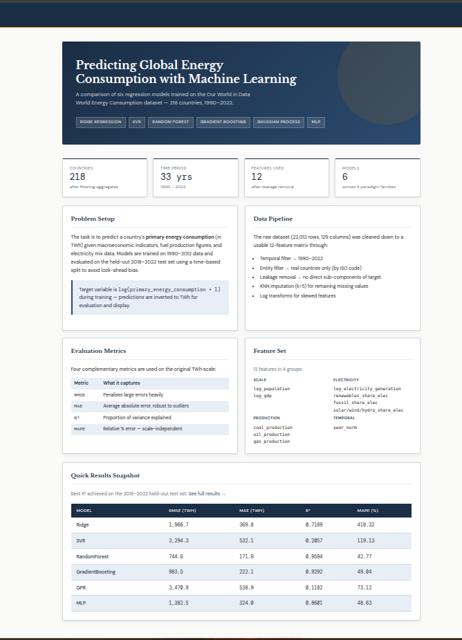
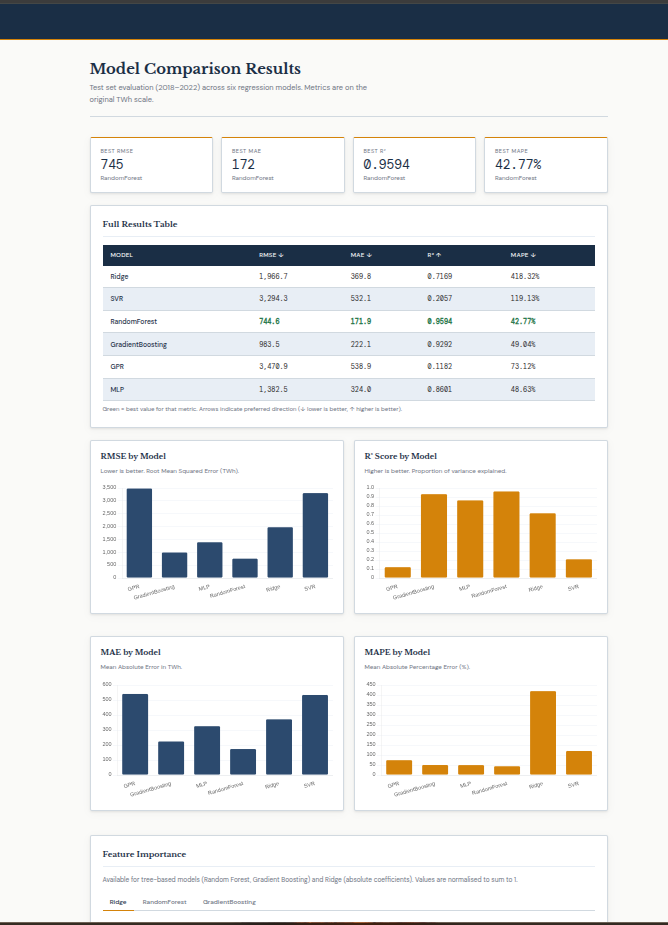
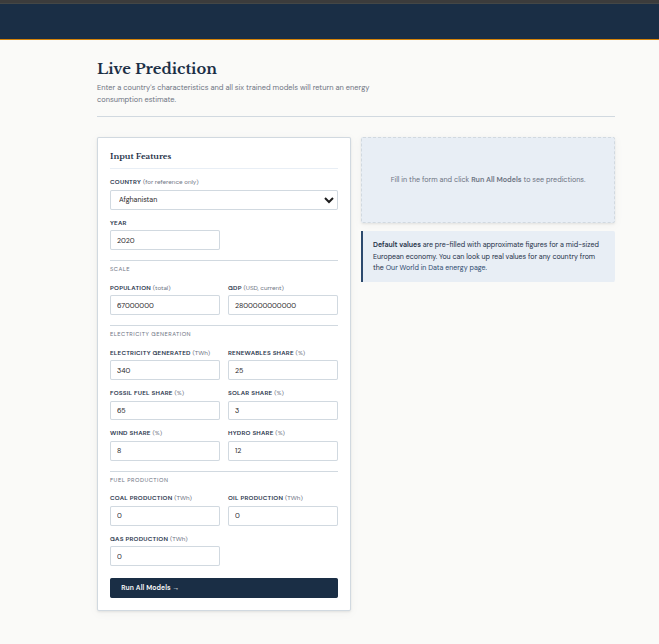
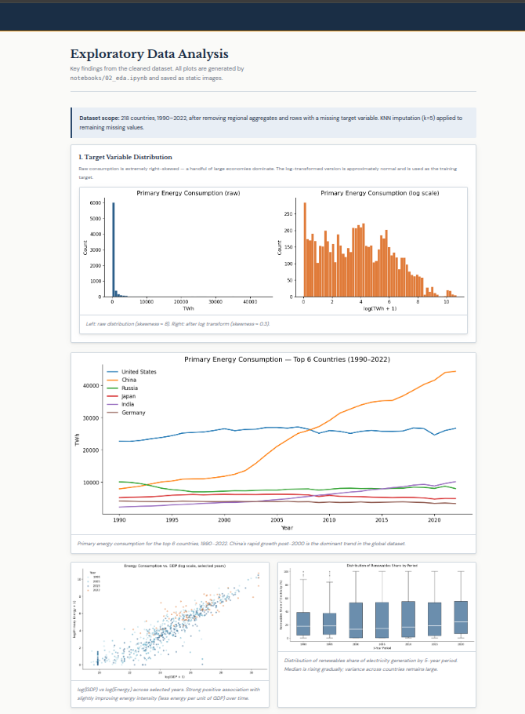
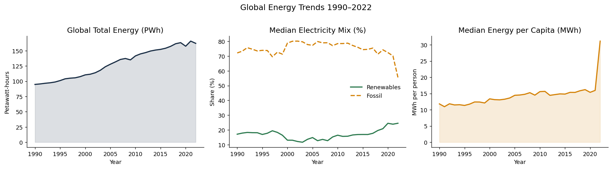
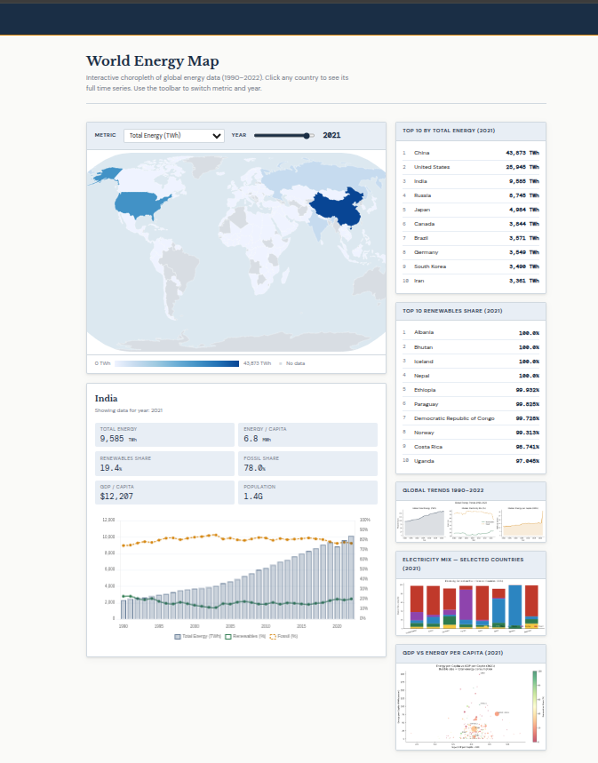
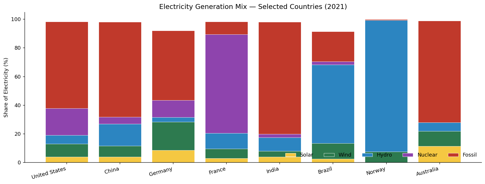
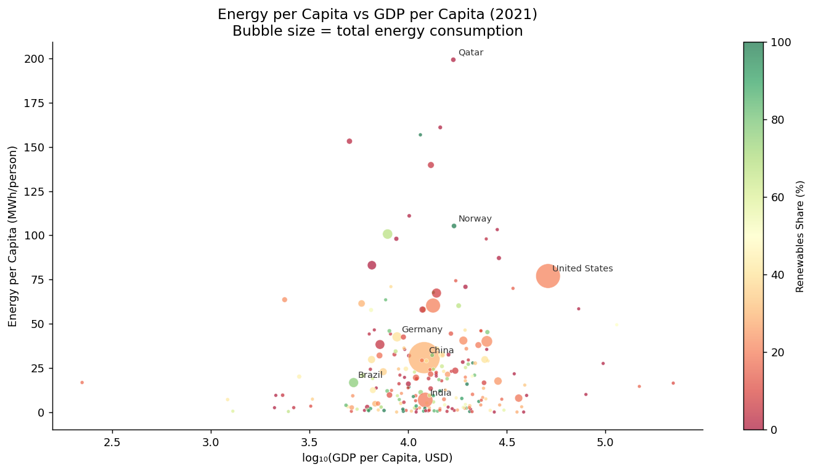

# World Energy Consumption — ML Regression Comparison

> **MSc Artificial Intelligence** — Individual Project  
> Dataset: [Our World in Data — World Energy Consumption](https://github.com/owid/energy-data)

---

## About

This project compares six machine learning regression models on the task of predicting a country's primary energy consumption (TWh) given its economic and energy characteristics. The dataset covers 218 countries from 1990 to 2022 and comes from Our World in Data's World Energy Consumption collection.

The reason for selecting the given problem is because the data is messy in ways that actually matter. The target variable has a skewness of around 8 in raw form — the United States and China dwarf almost every other country — and there are meaningful missing values throughout. Several columns look like useful predictors until you notice they are direct arithmetic sub-components of the target, which would be data leakage. Working through those issues turned out to be more instructive than the model selection itself.

---

## Data & Preprocessing

The raw dataset has 22,012 rows and 129 columns. After filtering to 1990–2022 and removing regional aggregates (e.g. "World", "ASEAN"), the working dataset covers 218 countries with 6,965 observations.

Features were selected based on two criteria: missingness below 35%, and no leakage. `fossil_fuel_consumption` (r = 0.998 with the target) and `electricity_demand` (r = 0.991) were excluded entirely. The final 12 features fall into four groups:

- **Scale** — log-transformed population and GDP
- **Electricity** — total generation, plus share of renewables, fossil, solar, wind, and hydro
- **Fuel production** — coal, oil, and gas production in TWh
- **Temporal** — year normalised to [0, 1]

GDP, population, and electricity generation are log-transformed to reduce right skew. The target is also trained in log space and inverted back to TWh for evaluation — this single preprocessing decision has more impact on linear model performance than any hyperparameter choice.

Missing values are filled using KNN imputation (k=5) rather than median imputation. Country-level energy data has strong regional structure, so nearest-neighbour imputation is more appropriate than treating each column independently.

The data is split **by time** — training on 1990–2012, validation on 2013–2017, test on 2018–2022. Random shuffling is not used because it would expose future data to the model during training.

---

## Models

Six models are compared, spanning four different modelling paradigms:

| Model | Notes |
|---|---|
| **Ridge Regression** | Linear baseline with L2 regularisation. Sensitive to the skewed target if log transform is skipped. |
| **Support Vector Regression** | RBF kernel, captures non-linearity. Slower to train but competitive on mid-sized data. |
| **Random Forest** | 200 trees, max depth 12. Handles the mix of sparse production features and dense share features naturally. |
| **Gradient Boosting** | 300 estimators, learning rate 0.05. Strong on tabular data; slightly slower than Random Forest here. |
| **Gaussian Process Regression** | Matérn 3/2 kernel. Trained on a 2,000-row subsample to keep it tractable. Returns uncertainty estimates alongside predictions. |
| **MLP Neural Network** | Two hidden layers (128, 64), ReLU activations, early stopping. Included as a deep learning baseline. |

All models are wrapped in an sklearn Pipeline so feature scaling is handled consistently.

---

## Results

Evaluated on the held-out 2018–2022 test set, on the original TWh scale:

| Model | RMSE (TWh) | MAE (TWh) | R² | MAPE (%) |
|---|---|---|---|---|
| Ridge Regression | 1,966.7 | 369.8 | 0.717 | 418.3 |
| SVR | 3,294.3 | 532.1 | 0.206 | 119.1 |
| **Random Forest** | **744.6** | **171.9** | **0.959** | **42.8** |
| Gradient Boosting | 983.5 | 222.1 | 0.929 | 49.0 |
| MLP | 1,382.5 | 324.0 | 0.860 | 48.6 |
| Gaussian Process | 3,470.9 | 538.9 | 0.118 | 73.1 |

Random Forest wins on every metric. The Ridge MAPE of 418% is dominated by small island states where the model over-predicts because it cannot capture the non-linearity between income and energy use at the low end. The GPR result is partly a subsample artefact — trained on 2,000 rows it likely underfits on a dataset of this size.

Feature importance is consistent across both tree models: `log_gdp` accounts for roughly 71% of the split importance, `log_electricity_generation` around 23%, and everything else is marginal.

---

## Web App

The results are presented through a FastAPI web app with five pages, built with plain HTML, CSS, Chart.js, and D3.js.

---

### Overview (`/`)

Summary of the project setup — dataset scope, features used, evaluation metrics, and a quick results table once models are trained.

---

### Results (`/results`)

Model comparison with a full metrics table, four Chart.js bar charts (one per metric), and a feature importance panel with tabbed views per model.

---

### Live Prediction (`/predict`)

Enter any country's characteristics and all six models return a prediction simultaneously. Results appear as a card grid and a bar chart. When models disagree sharply it usually means the input sits outside the training distribution.

---

### EDA Gallery (`/eda`)

A gallery of the exploratory analysis plots with written commentary — target distribution, top consuming countries over time, correlation heatmap, GDP vs energy scatter, and renewables share trend by decade.

*Global total energy (PWh), median electricity mix, and median energy per capita — 1990 to 2022.*

---

### World Map (`/map`)

An interactive D3.js choropleth coloured entirely from the OWID dataset. A metric dropdown (six options: total energy, energy per capita, renewables share, fossil share, electricity generation, GDP per capita) and a year slider (1990–2022) let you explore how the global energy picture has shifted over time. Clicking any country opens a detail panel with six stat boxes and a combined bar/line time series chart showing total energy alongside renewables and fossil share across all available years.

*Electricity generation mix for eight selected economies (2021). Norway is almost entirely hydro; France leans heavily on nuclear; Germany shows the clearest signs of an ongoing energy transition.*

*Energy per capita vs GDP per capita (2021). Bubble size = total consumption. Colour = renewables share (green = high, red = low). Qatar is an extreme outlier — very high energy use per person relative to income, driven by its gas-intensive economy.*

---

## What I would do differently

**Per-prediction SHAP values.** Global feature importance is in the app but local explanations are not. `shap.TreeExplainer` works directly with the Random Forest pipeline and would make the prediction page much more useful — showing not just what the model predicted but why.

**GPR on more data.** Sparse GP methods in `GPyTorch` would let it train on the full dataset rather than a 2,000-row subsample, and likely close most of the R² gap with the tree models.

**MAPE excluding micro-states.** The current MAPE is dominated by very small countries. Reporting it only for countries with consumption above 10 TWh would give a fairer picture of generalisation across the majority of the world.